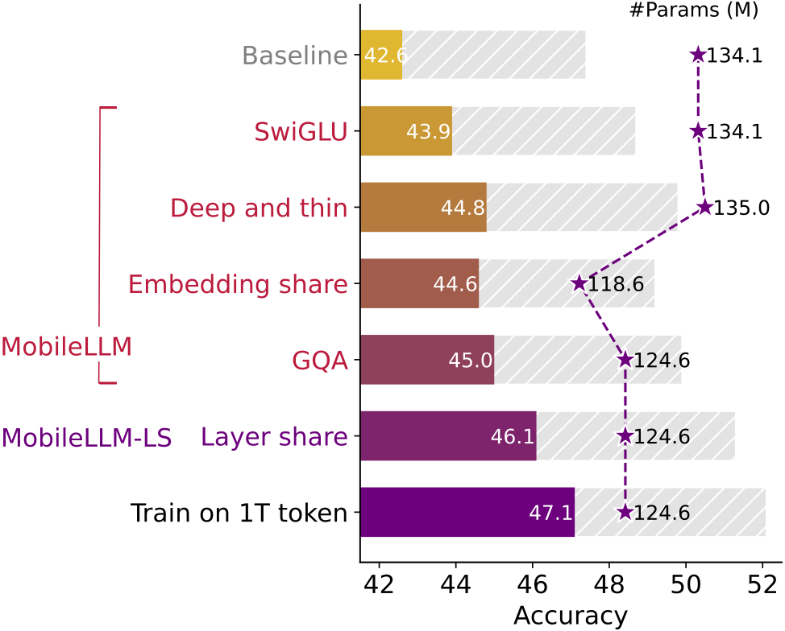

# MobileLLM

This repository contains the training code of MobileLLM introduced in our work: "[MobileLLM: Optimizing Sub-billion Parameter Language Models for On-Device Use Cases](https://arxiv.org/abs/2402.14905)", published in ICML 2024.

In this work, we comprehensively consider multiple design factors to obtain high-quality LLMs with fewer than a billion parameters. We integrated (1) SwiGLU activation function, (2) deep and thin architectures, (3) embedding sharing, (4) grouped-query attention to build MobileLLM. MobileLLM-125M/350M attains a remarkable 2.7%/4.3% accuracy boost over preceding 125M/350M SoTA models on zero-shot commonsense reasoning tasks. In our updated version, we further demonstrate that our design philosophy scales effectively to larger models, with SoTA results for MobileLLM-600M/1B/1.5B.

## Citation

If you find our code useful for your research, please consider citing:
    
    @article{liu2024mobilellm,
        title={MobileLLM: Optimizing Sub-billion Parameter Language Models for On-Device Use Cases},
        author={Liu, Zechun and Zhao, Changsheng and Iandola, Forrest and Lai, Chen and Tian, Yuandong and Fedorov, Igor and Xiong, Yunyang and Chang, Ernie and Shi, Yangyang and Krishnamoorthi, Raghuraman and others},
        journal={arXiv preprint arXiv:2402.14905},
        year={2024}
    }
    
## Run

### Step 1. Requirements:
* python 3.9, pytorch >= 2.0
* pip install -r requirement.txt
   
### Step 2. Data preprocessing
Dividing a tokenized dataset or tokenize your own dataset, and even distribute it across the total number of training nodes, where each node comprises 1x8 GPUs. Next, organize the data into the following structure: 
- basepath
  - 1
    - xxx.jsonl
  - 2
    - xxx.jsonl
  - ...
  - #nodes
    - xxx.jsonl

Each line of a jsonl file is a key-value pair of tokenized data {"token_ids": [1,2,3,4,...]}. 

Our training code is compatible with the data pre-processing method in https://github.com/LLM360/amber-data-prep.

### Step 3. Training script
The script `pretrain.sh` is provided to initiate training on a 1x8 node setup using torchrun. This script can be modified to adjust the `--nnodes` parameter and other settings to suit different multi-node configurations, such as those using slurm or torchx. The learning rate in the script is for 1x8 node with a batch size of 32. If you increase the number of nodes or the batch size, you need to increase the learning rate linearly.

Steps to run:
* In `pretrain.sh` file, specify the  `--train_data_local_path` to the pre-processed data in Step 2 and `--input_model_filename` to `./configs/{model_size}/`.
* Run `bash pretrain.sh `

### Others
The model weights is still under legal review. If you have any questions, feel free to email (zechunliu at meta dot com) and (cszhao at meta dot com)

## Results on Zero-shot Common Sense Reasoning tasks

### MobileLLM-125M

| model | boolq | piqa | siqa | hellaswag | winogrande | arc_easy | arc_challenge | obqa | avg. |
| --- | --- | --- | --- | --- | --- | --- | --- | --- | --- |
| OPT-125M | 41.3 | 25.2 | 57.5 | 62.0 | 41.9 | 31.1 | 31.2 | 50.8 | 42.6 |
| GPT-neo-125M | 40.7 | 24.8 | 61.3 | 62.5 | 41.9 | 29.7 | 31.6 | 50.7 | 42.9 |
| Pythia-160M | 40.0 | 25.3 | 59.5 | 62.0 | 41.5 | 29.9 | 31.2 | 50.9 | 42.5 |
| **MobileLLM-125M** | 43.9 | 27.1 | 60.2 | 65.3 | 42.4 | 38.9 | 39.5 | 53.1 | **46.3** |
| **MobileLLM-LS-125M** | 45.8 | 28.7 | 60.4 | 65.7 | 42.9 | 39.5 | 41.1 | 52.1 | **47.0** |

### MobileLLM-350M

| model | boolq | piqa | siqa | hellaswag | winogrande | arc_easy | arc_challenge | obqa | avg. |
| --- | --- | --- | --- | --- | --- | --- | --- | --- | --- |
| OPT-350M | 41.9 | 25.7 | 54.0 | 64.8 | 42.6 | 36.2 | 33.3 | 52.4 | 43.9 |
| Pythia-410M | 47.1 | 30.3 | 55.3 | 67.2 | 43.1 | 40.1 | 36.2 | 53.4 | 46.6 |
| **MobileLLM-350M** | 53.8 | 33.5 | 62.4 | 68.6 | 44.7 | 49.6 | 40.0 | 57.6 | **51.3** |
| **MobileLLM-LS-350M** | 54.4 | 32.5 | 62.8 | 69.8 | 44.1 | 50.6 | 45.8 | 57.2 | **52.1** | 

### MobileLLM-600M

| model | boolq | piqa | siqa | hellaswag | winogrande | arc_easy | arc_challenge | obqa | avg. |
| --- | --- | --- | --- | --- | --- | --- | --- | --- | --- |
| Qwen1.5-500M | 54.7 | 32.1 | 46.9 | 68.9 | 46.0 |  48.8 | 37.7 | 55.0 | 48.8 | 
| BLOOM-560M | 43.7 | 27.5 | 53.7 | 65.1 | 42.5 | 36.5 | 32.6 | 52.2 | 44.2 | 
| MobiLlama-800M | 52.0 | 31.7 | 54.6 | 73.0 |  43.3 | 52.3 | 42.5 | 56.3 | 50.7 | 
| **MobileLLM-600M** | 58.1 |  35.8 |  61.0 |  72.3 | 44.9 | 55.9 |  47.9 |  58.6 | **54.3** |  

### MobileLLM-1B

| model | boolq | piqa | siqa | hellaswag | winogrande | arc_easy | arc_challenge | obqa | avg. |
| --- | --- | --- | --- | --- | --- | --- | --- | --- | --- |
| Pythia-1B | 49.9 | 30.4 | 58.7 | 69.2 | 43.3 | 47.4 | 38.6 | 52.2 | 48.7 | 
| MobiLlama-1B | 59.7 | 38.4 | 59.2 | 74.5 | 44.9 | 62.0 | 43.7 | 59.0 | 55.2 | 
| Falcon-1B | 59.5 | 38.4 | 63.9 | 74.6 |  44.6 | 62.9 |  45.6 | 60.9 | 56.3 | 
| BLOOM-1.1B | 47.6 | 27.3 | 58.6 | 67.0 | 42.4 | 42.2 | 36.6 | 53.8 | 46.9 | 
| TinyLlama-1.1B | 59.2 | 37.1 | 58.1 | 72.9 | 43.9 | 59.1 | 44.7 | 58.8 | 54.2 | 
| **MobileLLM-1B** | 63.0 |  39.0 |  66.7 |  74.4 | 45.0 |  61.4 | 46.8 | 62.3 | **57.3** |  

### MobileLLM-1.5B

| model | boolq | piqa | siqa | hellaswag | winogrande | arc_easy | arc_challenge | obqa | avg. |
| --- | --- | --- | --- | --- | --- | --- | --- | --- | --- |
| GPT-neo-1.3B | 51.3 | 33.0 | 61.8 | 70.9 | 43.7 | 48.6 | 41.2 | 54.5 | 50.6 | 
| OPT-1.3B | 54.4 | 31.7 | 58.4 | 71.5 | 44.7 | 53.7 | 44.6 | 59.1 | 52.3 | 
| BLOOM-1.7B | 50.9 | 31.2 | 61.7 | 70.0 | 43.2 | 47.2 | 36.2 | 56.1 | 49.6 | 
| Qwen1.5-1.8B | 61.1 | 36.5 | 68.3 | 74.1 | 47.2 |  60.4 | 42.9 | 61.2 | 56.5 | 
| GPT-neo-2.7B | 55.8 | 34.3 | 62.4 | 72.9 | 43.6 | 55.6 | 40.0 | 57.9 | 52.8 | 
| OPT-2.7B | 56.6 | 34.6 | 61.8 | 74.5 | 45.6 | 60.2 | 48.2 | 59.6 | 55.1 | 
| Pythia-2.8B | 59.4 | 38.9 | 66.1 |  73.8 | 44.5 | 59.6 | 45.0 | 59.4 | 55.8 | 
| BLOOM-3B | 55.1 | 33.6 | 62.1 | 70.5 | 43.2 | 53.9 | 41.6 | 58.2 | 52.3 | 
| **MobileLLM-1.5B** | 67.5 |  40.9 |  65.7 | 74.8 |  46.4 | 64.5 | 50.5 | 64.7 | **59.4** | 

## Acknowledgement

This code is partially based on HuggingFace transformer repo.

## Contact

Zechun Liu, Meta Inc (zechunliu at meta dot com)

Changsheng Zhao, Meta Inc (cszhao at meta dot com)

## License

BiT is CC-BY-NC 4.0 licensed as of now.

